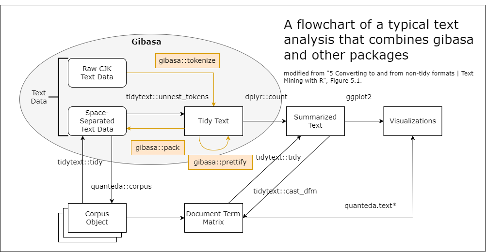

<!-- README.md is generated from README.Rmd. Please edit that file -->

```{r, include = FALSE}
knitr::opts_chunk$set(
  collapse = TRUE,
  comment = "#>",
  fig.path = "man/figures/README-",
  out.width = "100%"
)
pkgload::load_all(export_all = FALSE)
```

# gibasa

<!-- badges: start -->
[](https://paithiov909.r-universe.dev/gibasa)

[](https://github.com/paithiov909/gibasa/actions)
[](https://app.codecov.io/gh/paithiov909/gibasa)
[](https://cran.r-project.org/package=gibasa)
<!-- badges: end -->

## Overview

gibasa is a lightweight **Rcpp wrapper for MeCab**, a morphological analyzer for CJK text.

Morphological analysis is essential when processing CJK languages because words are typically not separated by whitespace. Simple tokenizers such as `tokenizers::tokenize_words()` may therefore split text into incorrect tokens.

The goal of gibasa is to provide a **tidytext-style tokenization workflow for CJK text**.
To support this workflow, gibasa provides three main functions:

- `gibasa::tokenize()` — tokenize text using MeCab
- `gibasa::prettify()` — expand MeCab feature strings into columns
- `gibasa::pack()` — reconstruct whitespace-separated text



`tokenize()` converts a TIF-compliant data frame into tidy token data so that it can be used as a drop-in alternative to `tidytext::unnest_tokens()` for CJK text processing.

`prettify()` parses the feature string returned by MeCab and splits it into structured columns.

`pack()` performs the reverse transformation and reconstructs a whitespace-separated corpus from tidy tokens.

## Installation

You can install gibasa from [CRAN](https://cran.r-project.org/package=gibasa) or [r-universe](https://paithiov909.r-universe.dev/gibasa).

```r
## Install gibasa from r-universe
install.packages(
  "gibasa",
  repos = c("https://paithiov909.r-universe.dev", "https://cloud.r-project.org")
)

## Or install the development version
Sys.setenv(MECAB_DEFAULT_RC = "/fullpath/to/your/mecabrc") # if necessary
remotes::install_github("paithiov909/gibasa")
```

To use gibasa, a MeCab dictionary must be available on the system.

On Linux and macOS, MeCab and dictionaries can usually be installed using the system package manager. On Windows, use the installer available [here](https://github.com/ikegami-yukino/mecab/releases/tag/v0.996.2).

Note that gibasa requires a UTF-8 dictionary, not a Shift-JIS one.

Since v0.9.4, gibasa reads configuration from either

- the file specified by the `MECABRC` environment variable, or
- `~/.mecabrc`

If your dictionary is installed in a non-standard location, create a mecabrc file that specifies the dictionary directory.

For a quick IPA dictionary setup, you can use [ipadic](https://pypi.org/project/ipadic/) from PyPI.

```sh
$ python3 -m pip install ipadic
$ python3 -c "import ipadic; print('dicdir=' + ipadic.DICDIR);" > ~/.mecabrc
```

## Usage

### Tokenize sentences

```{r}
res <- gibasa::tokenize(
  data.frame(
    doc_id = seq_along(gibasa::ginga[5:8]),
    text = gibasa::ginga[5:8]
  ),
  text,
  doc_id
)
res
```

### Prettify output

```{r}
gibasa::prettify(res)
gibasa::prettify(res, col_select = 1:3)
gibasa::prettify(res, col_select = c(1, 3, 5))
gibasa::prettify(res, col_select = c("POS1", "Original"))
```

### Pack output

```{r}
res <- gibasa::prettify(res)
gibasa::pack(res)

dplyr::mutate(
  res,
  token = dplyr::if_else(is.na(Original), token, Original),
  token = paste(token, POS1, sep = "/")
) |>
  gibasa::pack() |>
  head(1L)
```

### Change dictionary

gibasa supports several dictionary schemes including:

- IPA
- UniDic
- [CC-CEDICT-MeCab](https://github.com/ueda-keisuke/CC-CEDICT-MeCab)
- [mecab-ko-dic](https://bitbucket.org/eunjeon/mecab-ko-dic/src/master/)

```{r}
## UniDic 2.1.2
gibasa::tokenize("あのイーハトーヴォのすきとおった風", sys_dic = file.path("mecab/unidic-lite")) |>
  gibasa::prettify(into = gibasa::get_dict_features("unidic26"))


## CC-CEDICT
gibasa::tokenize("它可以进行日语和汉语的语态分析", sys_dic = file.path("mecab/cc-cedict")) |>
  gibasa::prettify(into = gibasa::get_dict_features("cc-cedict"))


## mecab-ko-dic
gibasa::tokenize("하네다공항한정토트백", sys_dic = file.path("mecab/mecab-ko-dic")) |>
  gibasa::prettify(into = gibasa::get_dict_features("ko-dic"))
```

## Build dictionaries

### Build a system dictionary

```{r}
## build a new ipadic in temporary directory
build_sys_dic(
  dic_dir = file.path("mecab/ipadic-eucjp"), # replace here with path to your source dictionary
  out_dir = tempdir(),
  encoding = "euc-jp" # encoding of source csv files
)

## copy the 'dicrc' file
file.copy(file.path("mecab/ipadic-eucjp/dicrc"), tempdir())

dictionary_info(sys_dic = tempdir())
```

### Build a user dictionary

```{r}
## write a csv file and compile it into a user dictionary
writeLines(
  c(
    "月ノ,1290,1290,4579,名詞,固有名詞,人名,姓,*,*,月ノ,ツキノ,ツキノ",
    "美兎,1291,1291,8561,名詞,固有名詞,人名,名,*,*,美兎,ミト,ミト"
  ),
  con = (csv_file <- tempfile(fileext = ".csv"))
)
build_user_dic(
  dic_dir = file.path("mecab/ipadic-eucjp"),
  file = (user_dic <- tempfile(fileext = ".dic")),
  csv_file = csv_file,
  encoding = "utf8"
)

tokenize("月ノ美兎は箱の中", sys_dic = tempdir(), user_dic = user_dic)
```

## License

GPL (>=3).
