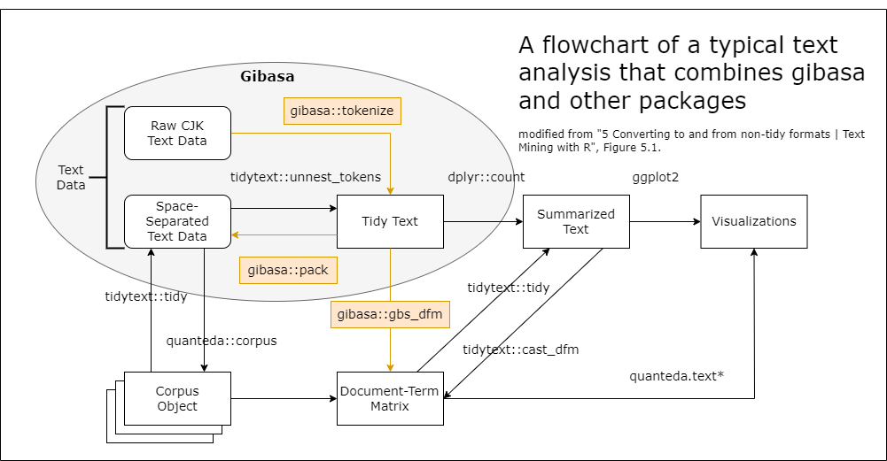

<!-- README.md is generated from README.Rmd. Please edit that file -->

# gibasa

<!-- badges: start -->

[](https://paithiov909.r-universe.dev)

[](https://github.com/paithiov909/gibasa/actions)
[](https://app.codecov.io/gh/paithiov909/gibasa)
[](https://cran.r-project.org/package=gibasa)
<!-- badges: end -->

## Overview

Gibasa is a plain ‘Rcpp’ wrapper of ‘MeCab’, a morphological analyzer
for CJK text.

Part-of-speech tagging with morphological analyzers is useful for
processing CJK text data. This is because most words in CJK text are not
separated by whitespaces and `tokenizers::tokenize_words` may split them
into wrong tokens.

The main goal of gibasa package is to provide an alternative to
`tidytext::unnest_tokens` for CJK text data. For this goal, gibasa
provides three main functions: `gibasa::tokenize`, `gibasa::prettify`,
and `gibasa::pack`.

<figure>

<figcaption aria-hidden="true">flowchart of a text analysis that
combines gibasa and other packages</figcaption>
</figure>

- `gibasa::tokenize` takes a TIF-compliant data.frame of corpus,
  returning tokens as format that known as ‘tidy text data’, so that
  users can replace `tidytext::unnest_tokens` with it for tokenizing CJK
  text.
- `gibasa::prettify` turns tagged features into columns.
- `gibasa::pack` takes a ‘tidy text data’, typically returning
  space-separated corpus.

## Installation

You can install binary package via
[CRAN](https://cran.r-project.org/package=gibasa) or
[r-universe](https://paithiov909.r-universe.dev/gibasa).

``` r
## Install gibasa from r-universe repository
install.packages("gibasa", repos = c("https://paithiov909.r-universe.dev", "https://cloud.r-project.org"))

## Or build from source package
Sys.setenv(MECAB_DEFAULT_RC = "/fullpath/to/your/mecabrc") # if necessary
remotes::install_github("paithiov909/gibasa")
```

To use gibasa package requires the
[MeCab](https://taku910.github.io/mecab/) library and its dictionary
installed and available.

In case using Linux or macOS, you can install them with their package
managers, or build and install from the source by yourself.

In case using Windows, use installer [built for
32bit](https://drive.google.com/uc?export=download&id=0B4y35FiV1wh7WElGUGt6ejlpVXc)
or [built for
64bit](https://github.com/ikegami-yukino/mecab/releases/tag/v0.996.2).
Note that gibasa requires a UTF-8 dictionary, not a Shift-JIS one.

As of v0.9.4, gibasa looks at the file specified by the environment
variable `MECABRC` or the file located at `~/.mecabrc`. If the MeCab
dictionary is in a different location than the default, create a mecabrc
file and specify where the dictionary is located.

For example, to install and use the
[ipadic](https://pypi.org/project/ipadic/) from PyPI, run:

``` sh
$ python3 -m pip install ipadic
$ python3 -c "import ipadic; print('dicdir=' + ipadic.DICDIR);" > ~/.mecabrc
```

## Usage

### Tokenize sentences

``` r
res <- gibasa::tokenize(
  data.frame(
    doc_id = seq_along(gibasa::ginga[5:8]),
    text = gibasa::ginga[5:8]
  ),
  text,
  doc_id
)
res
#> # A tibble: 187 × 5
#>    doc_id sentence_id token_id token        feature                             
#>    <fct>        <int>    <int> <chr>        <chr>                               
#>  1 1                1        1 　           記号,空白,*,*,*,*,　,　,　          
#>  2 1                1        2 カムパネルラ 名詞,一般,*,*,*,*,*                 
#>  3 1                1        3 が           助詞,格助詞,一般,*,*,*,が,ガ,ガ     
#>  4 1                1        4 手           名詞,一般,*,*,*,*,手,テ,テ          
#>  5 1                1        5 を           助詞,格助詞,一般,*,*,*,を,ヲ,ヲ     
#>  6 1                1        6 あげ         動詞,自立,*,*,一段,連用形,あげる,ア…
#>  7 1                1        7 まし         助動詞,*,*,*,特殊・マス,連用形,ます…
#>  8 1                1        8 た           助動詞,*,*,*,特殊・タ,基本形,た,タ,…
#>  9 1                1        9 。           記号,句点,*,*,*,*,。,。,。          
#> 10 1                1       10 それ         名詞,代名詞,一般,*,*,*,それ,ソレ,ソ…
#> # ℹ 177 more rows
```

### Prettify output

``` r
gibasa::prettify(res)
#> # A tibble: 187 × 13
#>    doc_id sentence_id token_id token        POS1   POS2  POS3  POS4  X5StageUse1
#>    <fct>        <int>    <int> <chr>        <chr>  <chr> <chr> <chr> <chr>      
#>  1 1                1        1 　           記号   空白  <NA>  <NA>  <NA>       
#>  2 1                1        2 カムパネルラ 名詞   一般  <NA>  <NA>  <NA>       
#>  3 1                1        3 が           助詞   格助… 一般  <NA>  <NA>       
#>  4 1                1        4 手           名詞   一般  <NA>  <NA>  <NA>       
#>  5 1                1        5 を           助詞   格助… 一般  <NA>  <NA>       
#>  6 1                1        6 あげ         動詞   自立  <NA>  <NA>  一段       
#>  7 1                1        7 まし         助動詞 <NA>  <NA>  <NA>  特殊・マス 
#>  8 1                1        8 た           助動詞 <NA>  <NA>  <NA>  特殊・タ   
#>  9 1                1        9 。           記号   句点  <NA>  <NA>  <NA>       
#> 10 1                1       10 それ         名詞   代名… 一般  <NA>  <NA>       
#> # ℹ 177 more rows
#> # ℹ 4 more variables: X5StageUse2 <chr>, Original <chr>, Yomi1 <chr>,
#> #   Yomi2 <chr>
```

``` r
gibasa::prettify(res, col_select = 1:3)
#> # A tibble: 187 × 7
#>    doc_id sentence_id token_id token        POS1   POS2   POS3 
#>    <fct>        <int>    <int> <chr>        <chr>  <chr>  <chr>
#>  1 1                1        1 　           記号   空白   <NA> 
#>  2 1                1        2 カムパネルラ 名詞   一般   <NA> 
#>  3 1                1        3 が           助詞   格助詞 一般 
#>  4 1                1        4 手           名詞   一般   <NA> 
#>  5 1                1        5 を           助詞   格助詞 一般 
#>  6 1                1        6 あげ         動詞   自立   <NA> 
#>  7 1                1        7 まし         助動詞 <NA>   <NA> 
#>  8 1                1        8 た           助動詞 <NA>   <NA> 
#>  9 1                1        9 。           記号   句点   <NA> 
#> 10 1                1       10 それ         名詞   代名詞 一般 
#> # ℹ 177 more rows
```

``` r
gibasa::prettify(res, col_select = c(1, 3, 5))
#> # A tibble: 187 × 7
#>    doc_id sentence_id token_id token        POS1   POS3  X5StageUse1
#>    <fct>        <int>    <int> <chr>        <chr>  <chr> <chr>      
#>  1 1                1        1 　           記号   <NA>  <NA>       
#>  2 1                1        2 カムパネルラ 名詞   <NA>  <NA>       
#>  3 1                1        3 が           助詞   一般  <NA>       
#>  4 1                1        4 手           名詞   <NA>  <NA>       
#>  5 1                1        5 を           助詞   一般  <NA>       
#>  6 1                1        6 あげ         動詞   <NA>  一段       
#>  7 1                1        7 まし         助動詞 <NA>  特殊・マス 
#>  8 1                1        8 た           助動詞 <NA>  特殊・タ   
#>  9 1                1        9 。           記号   <NA>  <NA>       
#> 10 1                1       10 それ         名詞   一般  <NA>       
#> # ℹ 177 more rows
```

``` r
gibasa::prettify(res, col_select = c("POS1", "Original"))
#> # A tibble: 187 × 6
#>    doc_id sentence_id token_id token        POS1   Original
#>    <fct>        <int>    <int> <chr>        <chr>  <chr>   
#>  1 1                1        1 　           記号   　      
#>  2 1                1        2 カムパネルラ 名詞   <NA>    
#>  3 1                1        3 が           助詞   が      
#>  4 1                1        4 手           名詞   手      
#>  5 1                1        5 を           助詞   を      
#>  6 1                1        6 あげ         動詞   あげる  
#>  7 1                1        7 まし         助動詞 ます    
#>  8 1                1        8 た           助動詞 た      
#>  9 1                1        9 。           記号   。      
#> 10 1                1       10 それ         名詞   それ    
#> # ℹ 177 more rows
```

### Pack output

``` r
res <- gibasa::prettify(res)
gibasa::pack(res)
#> # A tibble: 4 × 2
#>   doc_id text                                                                   
#>   <fct>  <chr>                                                                  
#> 1 1      　 カムパネルラ が 手 を あげ まし た 。 それ から 四 、 五 人 手 を … 
#> 2 2      　 ところが 先生 は 早く も それ を 見つけ た の でし た 。            
#> 3 3      「 ジョバンニ さん 。 あなた は わかっ て いる の でしょ う 」         
#> 4 4      　 ジョバンニ は 勢い よく 立ちあがり まし た が 、 立っ て みる と も…
```

``` r

dplyr::mutate(
  res,
  token = dplyr::if_else(is.na(Original), token, Original),
  token = paste(token, POS1, sep = "/")
) |>
  gibasa::pack() |>
  head(1L)
#> # A tibble: 1 × 2
#>   doc_id text                                                                  
#>   <fct>  <chr>                                                                 
#> 1 1      　/記号 カムパネルラ/名詞 が/助詞 手/名詞 を/助詞 あげる/動詞 ます/助…
```

### Change dictionary

IPA, UniDic,
[CC-CEDICT-MeCab](https://github.com/ueda-keisuke/CC-CEDICT-MeCab), and
[mecab-ko-dic](https://bitbucket.org/eunjeon/mecab-ko-dic/src/master/)
schemes are supported.

``` r
## UniDic 2.1.2
gibasa::tokenize("あのイーハトーヴォのすきとおった風", sys_dic = file.path("mecab/unidic-lite")) |>
  gibasa::prettify(into = gibasa::get_dict_features("unidic26"))
#> # A tibble: 6 × 30
#>   doc_id sentence_id token_id token   POS1   POS2  POS3  POS4  cType cForm lForm
#>   <fct>        <int>    <int> <chr>   <chr>  <chr> <chr> <chr> <chr> <chr> <chr>
#> 1 1                1        1 あの    感動詞 フィ… <NA>  <NA>  <NA>  <NA>  アノ 
#> 2 1                1        2 イーハ… 名詞   普通… 一般  <NA>  <NA>  <NA>  <NA> 
#> 3 1                1        3 の      助詞   格助… <NA>  <NA>  <NA>  <NA>  ノ   
#> 4 1                1        4 すきと… 動詞   一般  <NA>  <NA>  五段… 連用… スキ…
#> 5 1                1        5 た      助動詞 <NA>  <NA>  <NA>  助動… 連体… タ   
#> 6 1                1        6 風      名詞   普通… 一般  <NA>  <NA>  <NA>  カゼ 
#> # ℹ 19 more variables: lemma <chr>, orth <chr>, pron <chr>, orthBase <chr>,
#> #   pronBase <chr>, goshu <chr>, iType <chr>, iForm <chr>, fType <chr>,
#> #   fForm <chr>, kana <chr>, kanaBase <chr>, form <chr>, formBase <chr>,
#> #   iConType <chr>, fConType <chr>, aType <chr>, aConType <chr>,
#> #   aModeType <chr>
```

``` r


## CC-CEDICT
gibasa::tokenize("它可以进行日语和汉语的语态分析", sys_dic = file.path("mecab/cc-cedict")) |>
  gibasa::prettify(into = gibasa::get_dict_features("cc-cedict"))
#> # A tibble: 9 × 12
#>   doc_id sentence_id token_id token POS1  POS2  POS3  POS4  pinyin_pron
#>   <fct>        <int>    <int> <chr> <chr> <chr> <chr> <chr> <chr>      
#> 1 1                1        1 它    <NA>  <NA>  <NA>  <NA>  ta1        
#> 2 1                1        2 可以  <NA>  <NA>  <NA>  <NA>  ke3 yi3    
#> 3 1                1        3 进行  <NA>  <NA>  <NA>  <NA>  jin4 xing2 
#> 4 1                1        4 日语  <NA>  <NA>  <NA>  <NA>  Ri4 yu3    
#> 5 1                1        5 和    <NA>  <NA>  <NA>  <NA>  he2        
#> 6 1                1        6 汉语  <NA>  <NA>  <NA>  <NA>  Han4 yu3   
#> 7 1                1        7 的    <NA>  <NA>  <NA>  <NA>  di4        
#> 8 1                1        8 语态  <NA>  <NA>  <NA>  <NA>  yu3 tai4   
#> 9 1                1        9 分析  <NA>  <NA>  <NA>  <NA>  fen1 xi1   
#> # ℹ 3 more variables: traditional_char_form <chr>, simplified_char_form <chr>,
#> #   definition <chr>
```

``` r


## mecab-ko-dic
gibasa::tokenize("하네다공항한정토트백", sys_dic = file.path("mecab/mecab-ko-dic")) |>
  gibasa::prettify(into = gibasa::get_dict_features("ko-dic"))
#> # A tibble: 4 × 12
#>   doc_id sentence_id token_id token  POS   meaning presence reading type    
#>   <fct>        <int>    <int> <chr>  <chr> <chr>   <chr>    <chr>   <chr>   
#> 1 1                1        1 하네다 NNP   인명    F        하네다  <NA>    
#> 2 1                1        2 공항   NNG   장소    T        공항    <NA>    
#> 3 1                1        3 한정   NNG   <NA>    T        한정    <NA>    
#> 4 1                1        4 토트백 NNG   <NA>    T        토트백  Compound
#> # ℹ 3 more variables: first_pos <chr>, last_pos <chr>, expression <chr>
```

## Build dictionaries

### Build a system dictionary

``` r
## build a new ipadic in temporary directory
build_sys_dic(
  dic_dir = file.path("mecab/ipadic-eucjp"), # replace here with path to your source dictionary
  out_dir = tempdir(),
  encoding = "euc-jp" # encoding of source csv files
)
#> reading mecab/ipadic-eucjp/unk.def ... 40
#> reading mecab/ipadic-eucjp/Adverb.csv ... 3032
#> reading mecab/ipadic-eucjp/Conjunction.csv ... 171
#> reading mecab/ipadic-eucjp/Suffix.csv ... 1393
#> reading mecab/ipadic-eucjp/Noun.adverbal.csv ... 795
#> reading mecab/ipadic-eucjp/Noun.others.csv ... 151
#> reading mecab/ipadic-eucjp/Noun.org.csv ... 16668
#> reading mecab/ipadic-eucjp/Verb.csv ... 130750
#> reading mecab/ipadic-eucjp/Noun.place.csv ... 72999
#> reading mecab/ipadic-eucjp/Noun.csv ... 60477
#> reading mecab/ipadic-eucjp/Adnominal.csv ... 135
#> reading mecab/ipadic-eucjp/Noun.number.csv ... 42
#> reading mecab/ipadic-eucjp/Noun.verbal.csv ... 12146
#> reading mecab/ipadic-eucjp/Filler.csv ... 19
#> reading mecab/ipadic-eucjp/Others.csv ... 2
#> reading mecab/ipadic-eucjp/Noun.adjv.csv ... 3328
#> reading mecab/ipadic-eucjp/Interjection.csv ... 252
#> reading mecab/ipadic-eucjp/Postp-col.csv ... 91
#> reading mecab/ipadic-eucjp/Noun.nai.csv ... 42
#> reading mecab/ipadic-eucjp/Prefix.csv ... 221
#> reading mecab/ipadic-eucjp/Noun.name.csv ... 34202
#> reading mecab/ipadic-eucjp/Symbol.csv ... 208
#> reading mecab/ipadic-eucjp/Adj.csv ... 27210
#> reading mecab/ipadic-eucjp/Noun.demonst.csv ... 120
#> reading mecab/ipadic-eucjp/Noun.proper.csv ... 27327
#> reading mecab/ipadic-eucjp/Postp.csv ... 146
#> reading mecab/ipadic-eucjp/Auxil.csv ... 199
#> reading mecab/ipadic-eucjp/matrix.def ... 1316x1316
#> 
#> done!
```

``` r

## copy the 'dicrc' file
file.copy(file.path("mecab/ipadic-eucjp/dicrc"), tempdir())
#> [1] TRUE
```

``` r

dictionary_info(sys_dic = tempdir())
#>                 file_path charset lsize rsize   size type version
#> 1 /tmp/Rtmpdv4Hz8/sys.dic    utf8  1316  1316 392126    0     102
```

### Build a user dictionary

``` r
## write a csv file and compile it into a user dictionary
writeLines(
  c(
    "月ノ,1290,1290,4579,名詞,固有名詞,人名,姓,*,*,月ノ,ツキノ,ツキノ",
    "美兎,1291,1291,8561,名詞,固有名詞,人名,名,*,*,美兎,ミト,ミト"
  ),
  con = (csv_file <- tempfile(fileext = ".csv"))
)
build_user_dic(
  dic_dir = file.path("mecab/ipadic-eucjp"),
  file = (user_dic <- tempfile(fileext = ".dic")),
  csv_file = csv_file,
  encoding = "utf8"
)
#> reading /tmp/Rtmpdv4Hz8/file7e382367d347.csv ... 2
#> 
#> done!
```

``` r

tokenize("月ノ美兎は箱の中", sys_dic = tempdir(), user_dic = user_dic)
#> # A tibble: 6 × 5
#>   doc_id sentence_id token_id token feature                                     
#>   <fct>        <int>    <int> <chr> <chr>                                       
#> 1 1                1        1 月ノ  名詞,固有名詞,人名,姓,*,*,月ノ,ツキノ,ツキノ
#> 2 1                1        2 美兎  名詞,固有名詞,人名,名,*,*,美兎,ミト,ミト    
#> 3 1                1        3 は    助詞,係助詞,*,*,*,*,は,ハ,ワ                
#> 4 1                1        4 箱    名詞,一般,*,*,*,*,箱,ハコ,ハコ              
#> 5 1                1        5 の    助詞,連体化,*,*,*,*,の,ノ,ノ                
#> 6 1                1        6 中    名詞,非自立,副詞可能,*,*,*,中,ナカ,ナカ
```

## License

GPL (\>=3).
