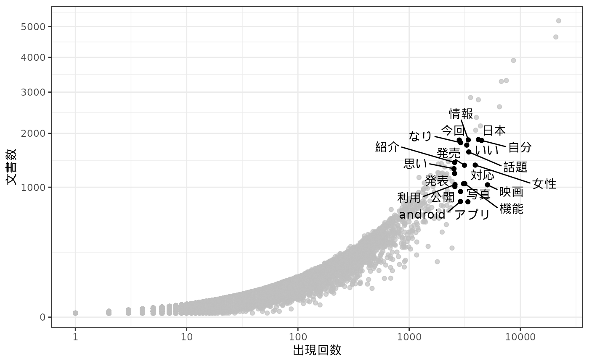
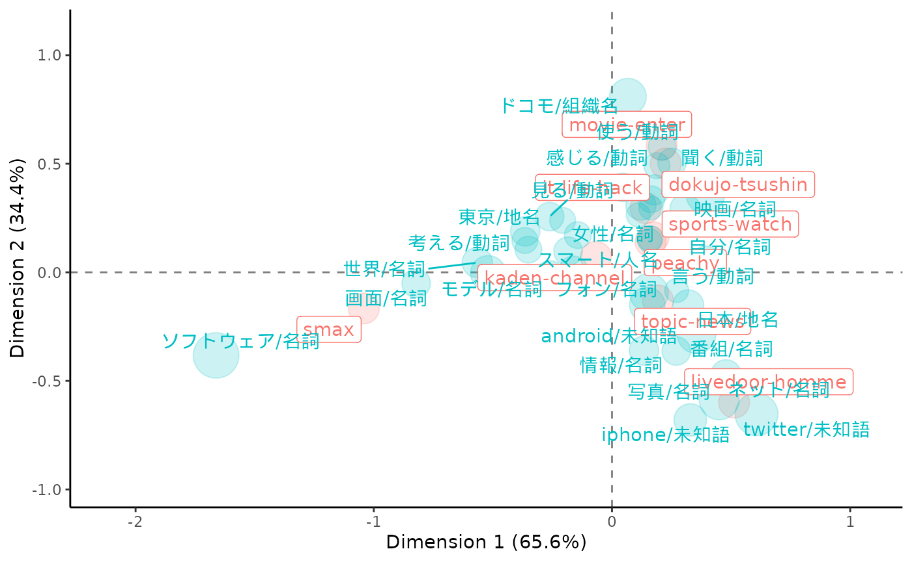

# Text Mining with quanteda and gibasa

## はじめに

このページでは、[quanteda](https://quanteda.io/)と[gibasa](https://paithiov909.github.io/gibasa/)を用いた簡単なテキストマイニングを例に、quantedaやその他のRパッケージとのあいだでテキストデータをやりとりする方法を紹介します。ここでおこなっているようなテキスト分析の例としては、次のサイトも参考にしてください。

- [Cookbook to Draw KHCoder-like Visualizations Using
  R](https://paithiov909.github.io/textvis-recipes/)

ちなみに、quantedaは[stringi](https://stringi.gagolewski.com/)をラップした関数によって日本語の文書でも分かち書きできるので、手元の辞書に収録されている表現どおりに分かち書きしたい場合や、品詞情報が欲しい場合でないかぎりは、形態素解析器を使うメリットはあまりないかもしれません。stringiが利用しているICUの[Boundary
Analysis](https://unicode-org.github.io/icu/userguide/boundaryanalysis/)の仕様については、[UAX#29](https://www.unicode.org/reports/tr29/#Word_Boundaries)などを参照してください。

------------------------------------------------------------------------

## Text Interchange Formats（TIF）

gibasaによる形態素解析の結果をquantedaなどと組み合わせて使ううえでは、[Text
Interchange
Formats（TIF）](https://github.com/ropensci/tif)という仕様に沿ったかたちのオブジェクトとしてテキストデータをもつことを意識すると便利です。

TIFというのは、2017年に[rOpenSci Text
Workshop](https://textworkshop17.ropensci.org/)で整備された、テキスト分析用のRパッケージのデザインパターンのようなものです。TIFでは、コーパス（corpus）、トークン（token）、文書単語行列（dtm）という3種類のオブジェクトの形式が定義されており、異なるパッケージ間で同様の形式を扱うようにすることで、複数のパッケージを通じて便利にテキスト分析を進められるようになっています。

このうち「コーパス」は、文書の集合をデータフレームあるいは名前付きベクトルの形式で保持したものです。

[ldccr](https://github.com/paithiov909/ldccr)では、[livedoorニュースコーパス](https://www.rondhuit.com/download.html#ldcc)をデータフレームの形式のコーパスとして読み込むことができます。より厳密に言うと、データフレーム形式のコーパスは、少なくとも`doc_id`と`text`という列を含むデータフレームなので、`doc_id`列は自分でつくる必要があります。コーパスにおける`doc_id`列は、文書によって一意なID列（character型である必要がある）で、`text`列は文書本体になります。「少なくとも」なので、このほかの列にここでの`category`列のような文書のメタ情報などが含まれる場合があります。

``` r
tbl <- ldccr::read_ldnws() |>
  dplyr::mutate(doc_id = as.character(dplyr::row_number())) |>
  dplyr::rename(text = body)
#> Parsing dokujo-tsushin...
#> Parsing it-life-hack...
#> Parsing kaden-channel...
#> Parsing livedoor-homme...
#> Parsing movie-enter...
#> Parsing peachy...
#> Parsing smax...
#> Parsing sports-watch...
#> Parsing topic-news...
#> Done.

tbl
#> # A tibble: 7,367 × 7
#>    file_path                       source time_stamp title text  category doc_id
#>    <chr>                           <chr>  <chr>      <chr> <chr> <fct>    <chr> 
#>  1 /tmp/RtmpOyw6am/text/dokujo-ts… http:… 2010-05-2… 友人代表… "友人代… dokujo-… 1     
#>  2 /tmp/RtmpOyw6am/text/dokujo-ts… http:… 2010-05-2… ネットで… "ネット… dokujo-… 2     
#>  3 /tmp/RtmpOyw6am/text/dokujo-ts… http:… 2010-05-2… 相次ぐ芸… "相次ぐ… dokujo-… 3     
#>  4 /tmp/RtmpOyw6am/text/dokujo-ts… http:… 2010-05-2… ムダな抵… "ムダな… dokujo-… 4     
#>  5 /tmp/RtmpOyw6am/text/dokujo-ts… http:… 2010-05-2… 税金を払… "税金を… dokujo-… 5     
#>  6 /tmp/RtmpOyw6am/text/dokujo-ts… http:… 2010-05-3… 読んでみ… "読んで… dokujo-… 6     
#>  7 /tmp/RtmpOyw6am/text/dokujo-ts… http:… 2010-05-2… 大人にな… "大人に… dokujo-… 7     
#>  8 /tmp/RtmpOyw6am/text/dokujo-ts… http:… 2010-05-2… 結婚して… "結婚し… dokujo-… 8     
#>  9 /tmp/RtmpOyw6am/text/dokujo-ts… http:… 2010-05-2… お肌に優… "お肌に… dokujo-… 9     
#> 10 /tmp/RtmpOyw6am/text/dokujo-ts… http:… 2010-05-3… 初回デー… "初回デ… dokujo-… 10    
#> # ℹ 7,357 more rows
```

livedoorニュースコーパスは文書分類をおこなうことを主な目的につくられたデータセットで、以下の9カテゴリのブログ記事からなっています。

- トピックニュース
- Sports Watch
- ITライフハック
- 家電チャンネル
- MOVIE ENTER
- 独女通信
- エスマックス
- livedoor HOMME
- Peachy

このうち一部だけをgibasaで形態素解析して、データフレームの形式の「トークン」としてもっておきます。トークンは、コーパスを文書ごとに適当な単位にまとめあげながら格納したものです。それぞれのトークンは単語だったり、単語のN-gramだったりします。

ここではKH
Coderで採用されている品詞体系を参考に、形態素解析された語の品詞情報を適当な値に置き換えています。なお、こうしたデータフレームの形式のトークンは、しばしばtidy
textとも呼ばれます。

``` r
toks <- tbl |>
  dplyr::select(doc_id, category, text) |>
  dplyr::slice_sample(prop = .8) |>
  dplyr::mutate(
    text = stringi::stri_trans_nfkc(text) |>
      stringi::stri_replace_all_regex("(https?\\://[[:alnum:]\\.\\-_/]+)", "\nURL\tタグ\n") |>
      stringi::stri_replace_all_regex("[\\s]{2,}", "\n") |>
      stringi::stri_trim_both()
  ) |>
  gibasa::tokenize(text, partial = TRUE) |>
  gibasa::prettify(
    col_select = c("POS1", "POS2", "POS3", "Original")
  ) |>
  dplyr::mutate(
    pos = dplyr::case_when(
      (POS1 == "タグ") ~ "タグ",
      (is.na(Original) & stringr::str_detect(token, "^[[:alpha:]]+$")) ~ "未知語",
      (POS1 == "感動詞") ~ "感動詞",
      (POS1 == "名詞" & POS2 == "一般" & stringr::str_detect(token, "^[\\p{Han}]{1}$")) ~ "名詞C",
      (POS1 == "名詞" & POS2 == "一般" & stringr::str_detect(token, "^[\\p{Hiragana}]+$")) ~ "名詞B",
      (POS1 == "名詞" & POS2 == "一般") ~ "名詞",
      (POS1 == "名詞" & POS2 == "固有名詞" & POS3 == "地域") ~ "地名",
      (POS1 == "名詞" & POS2 == "固有名詞" & POS3 == "人名") ~ "人名",
      (POS1 == "名詞" & POS2 == "固有名詞" & POS3 == "組織") ~ "組織名",
      (POS1 == "名詞" & POS2 == "形容動詞語幹") ~ "形容動詞",
      (POS1 == "名詞" & POS2 == "ナイ形容詞語幹") ~ "ナイ形容詞",
      (POS1 == "名詞" & POS2 == "固有名詞") ~ "固有名詞",
      (POS1 == "名詞" & POS2 == "サ変接続") ~ "サ変名詞",
      (POS1 == "名詞" & POS2 == "副詞可能") ~ "副詞可能",
      (POS1 == "動詞" & POS2 == "自立" & stringr::str_detect(token, "^[\\p{Hiragana}]+$")) ~ "動詞B",
      (POS1 == "動詞" & POS2 == "自立") ~ "動詞",
      (POS1 == "形容詞" & stringr::str_detect(token, "^[\\p{Hiragana}]+$")) ~ "形容詞B",
      (POS1 == "形容詞" & POS2 == "非自立") ~ "形容詞（非自立）",
      (POS1 == "形容詞") ~ "形容詞",
      (POS1 == "副詞" & stringr::str_detect(token, "^[\\p{Hiragana}]+$")) ~ "副詞B",
      (POS1 == "副詞") ~ "副詞",
      (POS1 == "助動詞" & Original %in% c("ない", "まい", "ぬ", "ん")) ~ "否定助動詞",
      .default = "その他"
    )
  ) |>
  dplyr::select(doc_id, category, token_id, token, pos, Original) |>
  dplyr::rename(original = Original)

toks
#> # A tibble: 3,932,690 × 6
#>    doc_id category       token_id token              pos      original    
#>    <fct>  <fct>             <int> <chr>              <chr>    <chr>       
#>  1 2736   livedoor-homme        1 インタビュー       サ変名詞 インタビュー
#>  2 2736   livedoor-homme        2 :                  サ変名詞 NA          
#>  3 2736   livedoor-homme        3 シーバスリーガル   未知語   NA          
#>  4 2736   livedoor-homme        4 マスターブレンダー 未知語   NA          
#>  5 2736   livedoor-homme        5 コリン             人名     コリン      
#>  6 2736   livedoor-homme        6 ・                 その他   ・          
#>  7 2736   livedoor-homme        7 スコット           人名     スコット    
#>  8 2736   livedoor-homme        8 プレミアム         名詞     プレミアム  
#>  9 2736   livedoor-homme        9 ウイスキー         名詞     ウイスキー  
#> 10 2736   livedoor-homme       10 として             その他   として      
#> # ℹ 3,932,680 more rows
```

## Tidy textからdfmへの変換

さて、実際にこういったトークンからさまざまな分析をするには、トークンを品詞などによって取捨選択しながら、分析したい単位ごとにグルーピングして集計する必要があります。

簡単に集計するだけであれば、次のようにdplyrの関数を使って集計することができます。こうした文書ID、単語と、単語の文書内頻度の3つ組のかたちをしたデータフレームは、summarized
textという呼び方をすることがあるようです。

``` r
toks |>
  dplyr::filter(!pos %in% c("その他", "タグ")) |>
  dplyr::count(doc_id, token) |>
  dplyr::arrange(dplyr::desc(n))
#> # A tibble: 1,037,325 × 3
#>    doc_id token            n
#>    <fct>  <chr>        <int>
#>  1 5674   /              607
#>  2 5674   ソフトバンク   508
#>  3 5189   /              204
#>  4 5074   ,              126
#>  5 5559   (              125
#>  6 5559   )              124
#>  7 5537   )              120
#>  8 5537   (              119
#>  9 1460   し             111
#> 10 5692   :              101
#> # ℹ 1,037,315 more rows
```

一方で、たとえば、特定のトークンの連なりは連語と見なして一つのトークンとして集計したいといった場合には、dplyrだけで集計するのはなかなか大変です。そういったより複雑なケースでは、quantedaの枠組みと組み合わせて使ったほうが便利なことがあります。

たとえば、IPA辞書では正しく解析されない「スマートフォン」といった語について、形態素解析した結果を確認した後に再度まとめあげて集計したい場合、quantedaを使うと次のように書くことができます。また、ここでは、うまく「記号」として解析されなかった記号類を除外するために、正規表現にマッチするトークンだけに絞り込んで集計しています。

``` r
dfm <- toks |>
  dplyr::filter(!pos %in% c("その他", "タグ")) |>
  gibasa::pack() |>
  quanteda::corpus() |>
  quanteda::tokens(what = "fastestword", remove_url = TRUE) |>
  quanteda::tokens_compound(
    quanteda::phrase(c("スマート フォン", "s - max"))
  ) |>
  quanteda::tokens_keep(
    "^[[:alnum:]]{2,}$",
    valuetype = "regex"
  ) |>
  quanteda::dfm()

dfm
#> Document-feature matrix of: 5,893 documents, 57,645 features (99.74% sparse) and 0 docvars.
#>       features
#> docs   インタビュー シーバスリーガル マスターブレンダー コリン スコット
#>   2736            1               14                  3      3        9
#>   2838            0                0                  0      0        0
#>   3570            0                0                  0      0        0
#>   1524            0                0                  0      0        0
#>   3643            0                0                  0      0        0
#>   7150            0                0                  0      0        0
#>       features
#> docs   プレミアム ウイスキー 世界中 愛さ 歴史
#>   2736          3          6      2    2    3
#>   2838          0          0      0    0    0
#>   3570          0          0      0    0    0
#>   1524          0          0      0    0    0
#>   3643          0          0      1    0    0
#>   7150          0          0      0    0    0
#> [ reached max_ndoc ... 5,887 more documents, reached max_nfeat ... 57,635 more features ]
```

[`quanteda::dfm()`](https://quanteda.io/reference/dfm.html)の戻り値は「文書単語行列（dtm）」を疎行列オブジェクト（dgCMatrix
of ‘Matrix’
package）として保持したものです（厳密には、dgCMatrixをスロットにもっているS4オブジェクト）。dfmオブジェクトは、`qunateda.textstats::textstat_frequency()`などを使って、さらに集計することができます。

``` r
dat <- dfm |>
  quanteda.textstats::textstat_frequency() |>
  dplyr::as_tibble()

head(dat)
#> # A tibble: 6 × 5
#>   feature frequency  rank docfreq group
#>   <chr>       <dbl> <dbl>   <dbl> <chr>
#> 1 する        22068     1    5204 all  
#> 2 ない        20800     2    4650 all  
#> 3 なっ         8666     3    3904 all  
#> 4 ある         7472     4    3317 all  
#> 5 なる         6738     5    3292 all  
#> 6 できる       6482     6    2622 all

dat |>
  ggplot(aes(x = frequency, y = docfreq)) +
  geom_jitter() +
  gghighlight::gghighlight(
    frequency > 2500 & docfreq < 2000
  ) +
  ggrepel::geom_text_repel(
    aes(label = feature),
    max.overlaps = 50
  ) +
  scale_x_log10() +
  scale_y_sqrt() +
  theme_bw() +
  labs(x = "出現回数", y = "文書数")
```



## Summarized textからdfmへの変換

「文書単語行列（dtm）」は、トークンを集計した結果を縦長のデータフレームとしてもっているsummarized
textを横に展開したものだと理解できます。両者は表現が異なるだけで、もっているデータとしては同じものであるため、quantedaにおけるdfmオブジェクトは[`tidytext::cast_dfm()`](https://juliasilge.github.io/tidytext/reference/document_term_casters.html)を使ってsummarized
textを変換することによって得ることもできます。

``` r
dfm <- toks |>
  dplyr::filter(
    pos %in% c(
      "名詞",
      "地名", "人名", "組織名", "固有名詞",
      "動詞", "未知語"
    ),
    stringr::str_detect(token, "^[[:alnum:]]{2,}$")
  ) |>
  dplyr::mutate(
    token = dplyr::if_else(is.na(original), tolower(token), original),
    token = paste(token, pos, sep = "/")
  ) |>
  dplyr::count(doc_id, token) |>
  tidytext::cast_dfm(doc_id, token, n)
```

dfmオブジェクトは`quanteda::dfm_*`という名前の関数を使って語彙を減らしたり、単語頻度に重みづけをしたりすることができます。

ここでは[`quanteda.textstats::textstat_simil()`](https://quanteda.io/reference/textstat_simil.html)で単語間の類似度を得て、階層的クラスタリングをしてみます。

``` r
clusters <- dfm |>
  quanteda::dfm_trim(min_termfreq = 40, termfreq_type = "rank") |>
  quanteda::dfm_weight(scheme = "boolean") |>
  quanteda.textstats::textstat_simil(margin = "features", method = "dice") |>
  rlang::as_function(~ 1 - .)() |>
  as.dist() |>
  hclust(method = "ward.D2")

dfm |>
  quanteda::dfm_trim(min_termfreq = 40, termfreq_type = "rank") |>
  quanteda::colSums() |>
  tibble::enframe() |>
  dplyr::mutate(
    clust = (clusters |> cutree(k = 5))[name]
  ) |>
  ggplot(aes(x = value, y = name, fill = factor(clust))) +
  geom_bar(stat = "identity", show.legend = FALSE) +
  scale_x_sqrt() +
  ggh4x::scale_y_dendrogram(hclust = clusters) +
  labs(x = "出現回数", y = element_blank()) +
  theme_bw()
#> Warning: `scale_y_dendrogram()` was deprecated in ggh4x 0.3.0.
#> ℹ Please use `legendry::scale_y_dendro()` instead.
#> This warning is displayed once every 8 hours.
#> Call `lifecycle::last_lifecycle_warnings()` to see where this warning was
#> generated.
#> Warning: `label` cannot be a <ggplot2::element_blank> object.
```


## dfmからSummarized textへの変換

dfmオブジェクトは[`tidytext::tidy()`](https://generics.r-lib.org/reference/tidy.html)でsummarized
textのかたちに変換することができます。[`tidytext::tidy()`](https://generics.r-lib.org/reference/tidy.html)と[`tidytext::cast_dfm()`](https://juliasilge.github.io/tidytext/reference/document_term_casters.html)をあわせて使うことで、dfmオブジェクトとsummarized
textのあいだで自由に変換しあうことができます。

``` r
dfm <- dfm |>
  quanteda::dfm_trim(
    min_termfreq = 40,
    termfreq_type = "rank"
  ) |>
  tidytext::tidy() |>
  dplyr::left_join(
    tbl |>
      dplyr::mutate(doc_id = factor(dplyr::row_number())) |>
      dplyr::select(doc_id, category),
    by = dplyr::join_by(document == doc_id)
  ) |>
  tidytext::cast_dfm(category, term, count)
```

ここでは、[`quanteda.textmodels::textmodel_ca()`](https://rdrr.io/pkg/quanteda.textmodels/man/textmodel_ca.html)を使ってdfmオブジェクトを対応分析にかけます。この関数の戻り値はcaパッケージのオブジェクトと互換性があるため、[`library(ca)`](http://www.carme-n.org/)としてから[`plot()`](https://rdrr.io/r/graphics/plot.default.html)に渡すことでバイプロットを描画することができます。

``` r
ca_fit <- dfm |>
  quanteda.textmodels::textmodel_ca(nd = 2, sparse = TRUE)

library(ca)
dat <- plot(ca_fit)
```


より見やすい表現としては、次のようにしてggplot2でバイプロットを描画することもできます。

``` r
tf <- quanteda::colSums(dfm)

make_ca_plot_df <- function(ca.plot.obj, row.lab = "Rows", col.lab = "Columns") {
  tibble::tibble(
    Label = c(
      rownames(ca.plot.obj$rows),
      rownames(ca.plot.obj$cols)
    ),
    Dim1 = c(
      ca.plot.obj$rows[, 1],
      ca.plot.obj$cols[, 1]
    ),
    Dim2 = c(
      ca.plot.obj$rows[, 2],
      ca.plot.obj$cols[, 2]
    ),
    Variable = c(
      rep(row.lab, nrow(ca.plot.obj$rows)),
      rep(col.lab, nrow(ca.plot.obj$cols))
    )
  )
}
dat <- dat |>
  make_ca_plot_df(row.lab = "Construction", col.lab = "Medium") |>
  dplyr::mutate(
    Size = dplyr::if_else(Variable == "Construction", mean(tf), tf[Label])
  )
# 非ASCII文字のラベルに対してwarningを出さないようにする
suppressWarnings({
  ca_sum <- summary(ca_fit)
  dim_var_percs <- ca_sum$scree[, "values2"]
})

dat |>
  ggplot(aes(x = Dim1, y = Dim2, col = Variable, label = Label)) +
  geom_vline(xintercept = 0, lty = "dashed", alpha = .5) +
  geom_hline(yintercept = 0, lty = "dashed", alpha = .5) +
  geom_jitter(aes(size = Size), alpha = .2, show.legend = FALSE) +
  ggrepel::geom_label_repel(
    data = \(x) dplyr::filter(x, Variable == "Construction"),
    show.legend = FALSE
  ) +
  ggrepel::geom_text_repel(
    data = \(x) dplyr::filter(x, Variable == "Medium", sqrt(Dim1^2 + Dim2^2) > 0.25),
    show.legend = FALSE
  ) +
  scale_x_continuous(
    limits = range(dat$Dim1) +
      c(diff(range(dat$Dim1)) * -0.2, diff(range(dat$Dim1)) * 0.2)
  ) +
  scale_y_continuous(
    limits = range(dat$Dim2) +
      c(diff(range(dat$Dim2)) * -0.2, diff(range(dat$Dim2)) * 0.2)
  ) +
  scale_size_area(max_size = 12) +
  labs(
    x = paste0("Dimension 1 (", signif(dim_var_percs[1], 3), "%)"),
    y = paste0("Dimension 2 (", signif(dim_var_percs[2], 3), "%)")
  ) +
  theme_classic()
#> Warning: ggrepel: 7 unlabeled data points (too many overlaps). Consider
#> increasing max.overlaps
```



## まとめ

ここで紹介したような、quantedaが実装しているオブジェクトとTIFにおけるコーパス（corpus）、トークン（token）、文書単語行列（dtm）とのあいだで変換する操作は、だいたい次の図のようにして実現することができます。


flowchart of a text analysis that combines gibasa and other packages

この図では「Text
Data」として括られているのがTIFにおけるコーパスで、最下段の「Corpus
Object」と「Document-Term
Matrix」として図示されているのがquantedaにおけるオブジェクトになります。ちなみに、この図中にはありませんが、tidy
textからコーパスのかたちを経ずにquantedaのtokensオブジェクトに変換するには、たとえば次のようにします。

``` r
toks |>
  dplyr::filter(
    pos %in% c(
      "名詞",
      "地名", "人名", "組織名", "固有名詞",
      "動詞", "未知語"
    ),
    stringr::str_detect(token, "^[[:alnum:]]{2,}$")
  ) |>
  dplyr::reframe(token = list(token), .by = doc_id) |>
  tibble::deframe() |>
  quanteda::as.tokens()
#> Tokens consisting of 5,893 documents.
#> 2736 :
#>  [1] "シーバスリーガル"   "マスターブレンダー" "コリン"            
#>  [4] "スコット"           "プレミアム"         "ウイスキー"        
#>  [7] "世界中"             "愛さ"               "シーバスリーガル"  
#> [10] "歴史"               "持つ"               "ブランド"          
#> [ ... and 132 more ]
#> 
#> 2838 :
#>  [1] "得る"               "プロフェッショナル" "スキル"            
#>  [4] "vol"                "本質"               "探る"              
#>  [7] "自分"               "足り"               "スキル"            
#> [10] "見え"               "プロフェッショナル" "ビジネス"          
#> [ ... and 282 more ]
#> 
#> 3570 :
#>  [1] "韓国"   "サニー" "永遠"   "仲間"   "洋楽"   "彩る"   "予告編" "韓国"  
#>  [9] "世代"   "超え"   "口コミ" "広がり"
#> [ ... and 120 more ]
#> 
#> 1524 :
#>  [1] "ぉっくす" "ミニ"     "ゅうす"   "ぉっくす" "じゅん"   "びちう"  
#>  [7] "アキバ"   "会え"     "待っ"     "楽しみ"   "ミニ"     "ヒエー"  
#> [ ... and 18 more ]
#> 
#> 3643 :
#>  [1] "中村"         "玉緒"         "グフフッ"     "日本"         "アカデミー"  
#>  [6] "自身"         "オスカー"     "女優"         "映画"         "マーガレット"
#> [11] "サッチャー"   "都内"        
#> [ ... and 137 more ]
#> 
#> 7150 :
#>  [1] "片山"     "さつき"   "吉本興業" "感じ"     "吉本興業" "お笑い"  
#>  [7] "芸人"     "次長"     "課長"     "河本"     "準一"     "母親"    
#> [ ... and 56 more ]
#> 
#> [ reached max_ndoc ... 5,887 more documents ]
```

一度にぜんぶ覚えるのはむずかしいでしょうが、こうした変換の方法を一通り覚えておくと、Rでテキストデータを扱うためのさまざまなバッケージについて、臨機応変に使いこなせるようになるはずです。少しずつでも、ぜひマスターしてみてください。

## セッション情報

``` r
sessioninfo::session_info()
#> ─ Session info ───────────────────────────────────────────────────────────────
#>  setting  value
#>  version  R version 4.5.2 (2025-10-31)
#>  os       Ubuntu 24.04.3 LTS
#>  system   x86_64, linux-gnu
#>  ui       X11
#>  language en
#>  collate  C.UTF-8
#>  ctype    C.UTF-8
#>  tz       UTC
#>  date     2025-11-21
#>  pandoc   3.1.11 @ /opt/hostedtoolcache/pandoc/3.1.11/x64/ (via rmarkdown)
#>  quarto   NA
#> 
#> ─ Packages ───────────────────────────────────────────────────────────────────
#>  package             * version    date (UTC) lib source
#>  bit                   4.6.0      2025-03-06 [1] RSPM
#>  bit64                 4.6.0-1    2025-01-16 [1] RSPM
#>  bslib                 0.9.0      2025-01-30 [1] RSPM
#>  ca                  * 0.71.1     2020-01-24 [1] RSPM
#>  cachem                1.1.0      2024-05-16 [1] RSPM
#>  cli                   3.6.5      2025-04-23 [1] RSPM
#>  codetools             0.2-20     2024-03-31 [3] CRAN (R 4.5.2)
#>  crayon                1.5.3      2024-06-20 [1] RSPM
#>  desc                  1.4.3      2023-12-10 [1] RSPM
#>  digest                0.6.39     2025-11-19 [1] RSPM
#>  dplyr                 1.1.4      2023-11-17 [1] RSPM
#>  evaluate              1.0.5      2025-08-27 [1] RSPM
#>  farver                2.1.2      2024-05-13 [1] RSPM
#>  fastmap               1.2.0      2024-05-15 [1] RSPM
#>  fastmatch             1.1-6      2024-12-23 [1] RSPM
#>  foreach               1.5.2      2022-02-02 [1] RSPM
#>  fs                    1.6.6      2025-04-12 [1] RSPM
#>  generics              0.1.4      2025-05-09 [1] RSPM
#>  ggh4x                 0.3.1      2025-05-30 [1] RSPM
#>  gghighlight           0.5.0      2025-06-14 [1] RSPM
#>  ggplot2             * 4.0.1      2025-11-14 [1] RSPM
#>  ggrepel               0.9.6      2024-09-07 [1] RSPM
#>  gibasa                1.1.2      2025-11-21 [1] local
#>  glmnet                4.1-10     2025-07-17 [1] RSPM
#>  glue                  1.8.0      2024-09-30 [1] RSPM
#>  gtable                0.3.6      2024-10-25 [1] RSPM
#>  hms                   1.1.4      2025-10-17 [1] RSPM
#>  htmltools             0.5.8.1    2024-04-04 [1] RSPM
#>  iterators             1.0.14     2022-02-05 [1] RSPM
#>  janeaustenr           1.0.0      2022-08-26 [1] RSPM
#>  jquerylib             0.1.4      2021-04-26 [1] RSPM
#>  jsonlite              2.0.0      2025-03-27 [1] RSPM
#>  knitr                 1.50       2025-03-16 [1] RSPM
#>  labeling              0.4.3      2023-08-29 [1] RSPM
#>  lattice               0.22-7     2025-04-02 [3] CRAN (R 4.5.2)
#>  ldccr                 2025.10.17 2025-11-21 [1] Github (paithiov909/ldccr@b362f2f)
#>  lifecycle             1.0.4      2023-11-07 [1] RSPM
#>  magrittr              2.0.4      2025-09-12 [1] RSPM
#>  Matrix                1.7-4      2025-08-28 [3] CRAN (R 4.5.2)
#>  memoise               2.0.1      2021-11-26 [1] RSPM
#>  nsyllable             1.0.1      2022-02-28 [1] RSPM
#>  pillar                1.11.1     2025-09-17 [1] RSPM
#>  pkgconfig             2.0.3      2019-09-22 [1] RSPM
#>  pkgdown               2.2.0      2025-11-06 [1] any (@2.2.0)
#>  proxyC                0.5.2      2025-04-25 [1] RSPM
#>  purrr                 1.2.0      2025-11-04 [1] RSPM
#>  quanteda              4.3.1      2025-07-10 [1] RSPM
#>  quanteda.textmodels   0.9.10     2025-02-10 [1] RSPM
#>  quanteda.textstats    0.97.2     2024-09-03 [1] RSPM
#>  R6                    2.6.1      2025-02-15 [1] RSPM
#>  ragg                  1.5.0      2025-09-02 [1] RSPM
#>  RColorBrewer          1.1-3      2022-04-03 [1] RSPM
#>  Rcpp                  1.1.0      2025-07-02 [1] RSPM
#>  RcppParallel          5.1.11-1   2025-08-27 [1] RSPM
#>  readr                 2.1.6      2025-11-14 [1] RSPM
#>  rlang                 1.1.6      2025-04-11 [1] RSPM
#>  rmarkdown             2.30       2025-09-28 [1] RSPM
#>  RSpectra              0.16-2     2024-07-18 [1] RSPM
#>  S7                    0.2.1      2025-11-14 [1] RSPM
#>  sass                  0.4.10     2025-04-11 [1] RSPM
#>  scales                1.4.0      2025-04-24 [1] RSPM
#>  sessioninfo           1.2.3      2025-02-05 [1] any (@1.2.3)
#>  shape                 1.4.6.1    2024-02-23 [1] RSPM
#>  SnowballC             0.7.1      2023-04-25 [1] RSPM
#>  stopwords             2.3        2021-10-28 [1] RSPM
#>  stringi               1.8.7      2025-03-27 [1] RSPM
#>  stringr               1.6.0      2025-11-04 [1] RSPM
#>  survival              3.8-3      2024-12-17 [3] CRAN (R 4.5.2)
#>  systemfonts           1.3.1      2025-10-01 [1] RSPM
#>  textshaping           1.0.4      2025-10-10 [1] RSPM
#>  tibble                3.3.0      2025-06-08 [1] RSPM
#>  tidyselect            1.2.1      2024-03-11 [1] RSPM
#>  tidytext              0.4.3      2025-07-25 [1] RSPM
#>  tokenizers            0.3.0      2022-12-22 [1] RSPM
#>  tzdb                  0.5.0      2025-03-15 [1] RSPM
#>  utf8                  1.2.6      2025-06-08 [1] RSPM
#>  vctrs                 0.6.5      2023-12-01 [1] RSPM
#>  vroom                 1.6.6      2025-09-19 [1] RSPM
#>  withr                 3.0.2      2024-10-28 [1] RSPM
#>  xfun                  0.54       2025-10-30 [1] RSPM
#>  yaml                  2.3.10     2024-07-26 [1] RSPM
#> 
#>  [1] /home/runner/work/_temp/Library
#>  [2] /opt/R/4.5.2/lib/R/site-library
#>  [3] /opt/R/4.5.2/lib/R/library
#>  * ── Packages attached to the search path.
#> 
#> ──────────────────────────────────────────────────────────────────────────────
```
