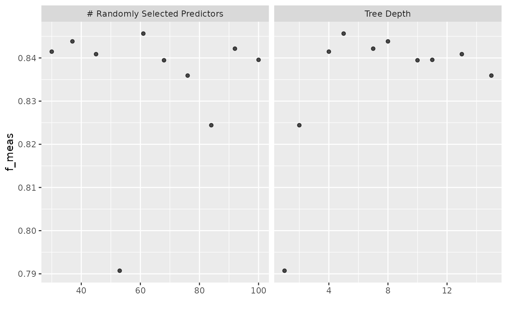

# Supervised Learning Using tidymodels and gibasa

## データの準備

[livedoorニュースコーパス](https://www.rondhuit.com/download.html#ldcc)を使います。このコーパスのカテゴリ分類はかなり易しいタスクであることが知られている（というか、一部のカテゴリではそのカテゴリを同定できる単語が本文に含まれてしまっている）ので、機械学習を手軽に試すのに便利です。テキストの特徴量をもとに以下の9カテゴリの分類をします。

- トピックニュース
- Sports Watch
- ITライフハック
- 家電チャンネル
- MOVIE ENTER
- 独女通信
- エスマックス
- livedoor HOMME
- Peachy

[ldccr](https://github.com/paithiov909/ldccr)でデータフレームにします。

``` r
tbl <- ldccr::read_ldnws() |>
  dplyr::mutate(doc_id = as.character(dplyr::row_number()))
#> Parsing dokujo-tsushin...
#> Parsing it-life-hack...
#> Parsing kaden-channel...
#> Parsing livedoor-homme...
#> Parsing movie-enter...
#> Parsing peachy...
#> Parsing smax...
#> Parsing sports-watch...
#> Parsing topic-news...
#> Done.
```

ここでは、KH
Coderの品詞体系における名詞・地名・人名・組織名・固有名詞・動詞・未知語を抽出し、IPA辞書に収録されている語については原形にしながら分かち書きにします。

``` r
corp <- tbl |>
  dplyr::mutate(
    text = stringi::stri_trans_nfkc(body) |>
      stringi::stri_replace_all_regex("(https?\\://[[:alnum:]\\.\\-_/]+)", "\nURL\tタグ\n") |>
      stringi::stri_replace_all_regex("[\\s]{2,}", "\n") |>
      stringi::stri_trim_both(),
    chunk = dplyr::ntile(dplyr::row_number(), 10)
  ) |>
  dplyr::group_by(chunk) |>
  dplyr::group_modify(\(df, idx) {
    data.frame(
      doc_id = df$doc_id,
      text = df$text
    ) |>
      gibasa::tokenize(text, partial = TRUE) |>
      gibasa::prettify(
        col_select = c("POS1", "POS2", "POS3", "Original")
      ) |>
      dplyr::mutate(
        pos = dplyr::case_when(
          (POS1 == "タグ") ~ "タグ",
          (is.na(Original) & stringr::str_detect(token, "^[[:alpha:]]+$")) ~ "未知語",
          (POS1 == "感動詞") ~ "感動詞",
          (POS1 == "名詞" & POS2 == "一般" & stringr::str_detect(token, "^[\\p{Han}]{1}$")) ~ "名詞C",
          (POS1 == "名詞" & POS2 == "一般" & stringr::str_detect(token, "^[\\p{Hiragana}]+$")) ~ "名詞B",
          (POS1 == "名詞" & POS2 == "一般") ~ "名詞",
          (POS1 == "名詞" & POS2 == "固有名詞" & POS3 == "地域") ~ "地名",
          (POS1 == "名詞" & POS2 == "固有名詞" & POS3 == "人名") ~ "人名",
          (POS1 == "名詞" & POS2 == "固有名詞" & POS3 == "組織") ~ "組織名",
          (POS1 == "名詞" & POS2 == "形容動詞語幹") ~ "形容動詞",
          (POS1 == "名詞" & POS2 == "ナイ形容詞語幹") ~ "ナイ形容詞",
          (POS1 == "名詞" & POS2 == "固有名詞") ~ "固有名詞",
          (POS1 == "名詞" & POS2 == "サ変接続") ~ "サ変名詞",
          (POS1 == "名詞" & POS2 == "副詞可能") ~ "副詞可能",
          (POS1 == "動詞" & POS2 == "自立" & stringr::str_detect(token, "^[\\p{Hiragana}]+$")) ~ "動詞B",
          (POS1 == "動詞" & POS2 == "自立") ~ "動詞",
          (POS1 == "形容詞" & stringr::str_detect(token, "^[\\p{Hiragana}]+$")) ~ "形容詞B",
          (POS1 == "形容詞" & POS2 == "非自立") ~ "形容詞（非自立）",
          (POS1 == "形容詞") ~ "形容詞",
          (POS1 == "副詞" & stringr::str_detect(token, "^[\\p{Hiragana}]+$")) ~ "副詞B",
          (POS1 == "副詞") ~ "副詞",
          (POS1 == "助動詞" & Original %in% c("ない", "まい", "ぬ", "ん")) ~ "否定助動詞",
          .default = "その他"
        )
      ) |>
        dplyr::filter(
          pos %in% c(
            "名詞",
            "地名", "人名", "組織名", "固有名詞",
            "動詞", "未知語"
          )
        ) |>
        dplyr::mutate(
          doc_id = droplevels(doc_id),
          token = dplyr::if_else(is.na(Original), token, Original),
          token = paste(token, pos, sep = "/")
        ) |>
        gibasa::pack()
  }) |>
  dplyr::ungroup() |>
  dplyr::left_join(dplyr::select(tbl, doc_id, category), by = "doc_id")
```

## モデルの学習

データを分割します。

``` r
corp_split <- rsample::initial_split(corp, prop = .8, strata = "category")
corp_train <- rsample::training(corp_split)
corp_test <- rsample::testing(corp_split)
```

以下のレシピとモデルで学習します。ここでは、ハッシュトリックを使っています。

なお、tidymodelsの枠組みの外であらかじめ分かち書きを済ませましたが、[`textrecipes::step_tokenize`](https://textrecipes.tidymodels.org/reference/step_tokenize.html)の`custom_token`引数に独自にトークナイザを指定することで、一つのstepとして分かち書きすることもできます。

``` r
NUM_TERMS <- 100L

corp_spec <-
  parsnip::boost_tree(
    trees = !!NUM_TERMS, # model_specに外にある変数を与える場合には、このようにinjectionします
    tree_depth = tune::tune(),
    mtry = tune::tune(),
    min_n = 5,
    learn_rate = .3,
    stop_iter = 5 # 例なので小さな値にしています
  ) |>
  parsnip::set_engine(
    "xgboost",
    nthread = !!max(1, parallel::detectCores() - 1, na.rm = TRUE)
  ) |>
  parsnip::set_mode("classification")

corp_rec <-
  recipes::recipe(
    category ~ text,
    data = corp_train
  ) |>
  textrecipes::step_tokenize(
    text,
    custom_token = \(x) strsplit(x, " +")
  ) |>
  textrecipes::step_tokenfilter(
    text,
    max_times = nrow(corp_train),
    max_tokens = NUM_TERMS * 5
  ) |>
  textrecipes::step_texthash(text, num_terms = NUM_TERMS)
```

``` r
corp_wflow <-
  workflows::workflow() |>
  workflows::add_model(corp_spec) |>
  workflows::add_recipe(corp_rec)
```

F値をメトリクスにして学習します。5分割CVで、簡単にですが、ハイパーパラメータ探索をします。

``` r
corp_tune_res <-
  corp_wflow |>
  tune::tune_grid(
    resamples = rsample::vfold_cv(corp_train, strata = category, v = 5L),
    grid = dials::grid_space_filling(
      dials::tree_depth(),
      dials::mtry(range = c(30L, NUM_TERMS)),
      size = 10L
    ),
    metrics = yardstick::metric_set(yardstick::f_meas),
    control = tune::control_grid(save_pred = TRUE)
  )
```

ハイパラ探索の要約を確認します。

``` r
ggplot2::autoplot(corp_tune_res)
```



`fit`します。

``` r
corp_wflow <-
  tune::finalize_workflow(corp_wflow, tune::select_best(corp_tune_res, metric = "f_meas"))

corp_fit <- tune::last_fit(corp_wflow, corp_split)
```

学習したモデルの精度を見てみます。

``` r
corp_fit |>
  tune::collect_predictions() |>
  yardstick::f_meas(truth = category, estimate = .pred_class)
#> # A tibble: 1 × 3
#>   .metric .estimator .estimate
#>   <chr>   <chr>          <dbl>
#> 1 f_meas  macro          0.852
```

## セッション情報

``` r
sessioninfo::session_info()
#> ─ Session info ───────────────────────────────────────────────────────────────
#>  setting  value
#>  version  R version 4.5.2 (2025-10-31)
#>  os       Ubuntu 24.04.3 LTS
#>  system   x86_64, linux-gnu
#>  ui       X11
#>  language en
#>  collate  C.UTF-8
#>  ctype    C.UTF-8
#>  tz       UTC
#>  date     2025-11-21
#>  pandoc   3.1.11 @ /opt/hostedtoolcache/pandoc/3.1.11/x64/ (via rmarkdown)
#>  quarto   NA
#> 
#> ─ Packages ───────────────────────────────────────────────────────────────────
#>  package      * version    date (UTC) lib source
#>  backports      1.5.0      2024-05-23 [1] RSPM
#>  bit            4.6.0      2025-03-06 [1] RSPM
#>  bit64          4.6.0-1    2025-01-16 [1] RSPM
#>  broom        * 1.0.10     2025-09-13 [1] RSPM
#>  bslib          0.9.0      2025-01-30 [1] RSPM
#>  cachem         1.1.0      2024-05-16 [1] RSPM
#>  class          7.3-23     2025-01-01 [3] CRAN (R 4.5.2)
#>  cli            3.6.5      2025-04-23 [1] RSPM
#>  codetools      0.2-20     2024-03-31 [3] CRAN (R 4.5.2)
#>  conflicted     1.2.0      2023-02-01 [1] RSPM
#>  crayon         1.5.3      2024-06-20 [1] RSPM
#>  data.table     1.17.8     2025-07-10 [1] RSPM
#>  desc           1.4.3      2023-12-10 [1] RSPM
#>  dials        * 1.4.2      2025-09-04 [1] RSPM
#>  DiceDesign     1.10       2023-12-07 [1] RSPM
#>  digest         0.6.39     2025-11-19 [1] RSPM
#>  dplyr        * 1.1.4      2023-11-17 [1] RSPM
#>  evaluate       1.0.5      2025-08-27 [1] RSPM
#>  farver         2.1.2      2024-05-13 [1] RSPM
#>  fastmap        1.2.0      2024-05-15 [1] RSPM
#>  float          0.3-3      2025-03-12 [1] RSPM
#>  fs             1.6.6      2025-04-12 [1] RSPM
#>  furrr          0.3.1      2022-08-15 [1] RSPM
#>  future         1.68.0     2025-11-17 [1] RSPM
#>  future.apply   1.20.0     2025-06-06 [1] RSPM
#>  generics       0.1.4      2025-05-09 [1] RSPM
#>  ggplot2      * 4.0.1      2025-11-14 [1] RSPM
#>  gibasa         1.1.2      2025-11-21 [1] local
#>  globals        0.18.0     2025-05-08 [1] RSPM
#>  glue           1.8.0      2024-09-30 [1] RSPM
#>  gower          1.0.2      2024-12-17 [1] RSPM
#>  GPfit          1.0-9      2025-04-12 [1] RSPM
#>  gtable         0.3.6      2024-10-25 [1] RSPM
#>  hardhat        1.4.2      2025-08-20 [1] RSPM
#>  hms            1.1.4      2025-10-17 [1] RSPM
#>  htmltools      0.5.8.1    2024-04-04 [1] RSPM
#>  infer        * 1.0.9      2025-06-26 [1] RSPM
#>  ipred          0.9-15     2024-07-18 [1] RSPM
#>  jquerylib      0.1.4      2021-04-26 [1] RSPM
#>  jsonlite       2.0.0      2025-03-27 [1] RSPM
#>  knitr          1.50       2025-03-16 [1] RSPM
#>  labeling       0.4.3      2023-08-29 [1] RSPM
#>  lattice        0.22-7     2025-04-02 [3] CRAN (R 4.5.2)
#>  lava           1.8.2      2025-10-30 [1] RSPM
#>  ldccr          2025.10.17 2025-11-21 [1] Github (paithiov909/ldccr@b362f2f)
#>  lgr            0.5.0      2025-07-23 [1] RSPM
#>  lhs            1.2.0      2024-06-30 [1] RSPM
#>  lifecycle      1.0.4      2023-11-07 [1] RSPM
#>  listenv        0.10.0     2025-11-02 [1] RSPM
#>  lubridate      1.9.4      2024-12-08 [1] RSPM
#>  magrittr       2.0.4      2025-09-12 [1] RSPM
#>  MASS           7.3-65     2025-02-28 [3] CRAN (R 4.5.2)
#>  Matrix         1.7-4      2025-08-28 [3] CRAN (R 4.5.2)
#>  memoise        2.0.1      2021-11-26 [1] RSPM
#>  mlapi          0.1.1      2022-04-24 [1] RSPM
#>  modeldata    * 1.5.1      2025-08-22 [1] RSPM
#>  nnet           7.3-20     2025-01-01 [3] CRAN (R 4.5.2)
#>  parallelly     1.45.1     2025-07-24 [1] RSPM
#>  parsnip      * 1.3.3      2025-08-31 [1] RSPM
#>  pillar         1.11.1     2025-09-17 [1] RSPM
#>  pkgconfig      2.0.3      2019-09-22 [1] RSPM
#>  pkgdown        2.2.0      2025-11-06 [1] any (@2.2.0)
#>  prodlim        2025.04.28 2025-04-28 [1] RSPM
#>  purrr        * 1.2.0      2025-11-04 [1] RSPM
#>  R6             2.6.1      2025-02-15 [1] RSPM
#>  ragg           1.5.0      2025-09-02 [1] RSPM
#>  RColorBrewer   1.1-3      2022-04-03 [1] RSPM
#>  Rcpp           1.1.0      2025-07-02 [1] RSPM
#>  RcppParallel   5.1.11-1   2025-08-27 [1] RSPM
#>  readr          2.1.6      2025-11-14 [1] RSPM
#>  recipes      * 1.3.1      2025-05-21 [1] RSPM
#>  RhpcBLASctl    0.23-42    2023-02-11 [1] RSPM
#>  rlang          1.1.6      2025-04-11 [1] RSPM
#>  rmarkdown      2.30       2025-09-28 [1] RSPM
#>  rpart          4.1.24     2025-01-07 [3] CRAN (R 4.5.2)
#>  rsample      * 1.3.1      2025-07-29 [1] RSPM
#>  rsparse        0.5.3      2025-02-17 [1] RSPM
#>  rstudioapi     0.17.1     2024-10-22 [1] RSPM
#>  S7             0.2.1      2025-11-14 [1] RSPM
#>  sass           0.4.10     2025-04-11 [1] RSPM
#>  scales       * 1.4.0      2025-04-24 [1] RSPM
#>  sessioninfo    1.2.3      2025-02-05 [1] any (@1.2.3)
#>  sfd            0.1.0      2024-01-08 [1] RSPM
#>  sparsevctrs    0.3.4      2025-05-25 [1] RSPM
#>  stringi        1.8.7      2025-03-27 [1] RSPM
#>  stringr        1.6.0      2025-11-04 [1] RSPM
#>  survival       3.8-3      2024-12-17 [3] CRAN (R 4.5.2)
#>  systemfonts    1.3.1      2025-10-01 [1] RSPM
#>  tailor       * 0.1.0      2025-08-25 [1] RSPM
#>  text2vec       0.6.4      2023-11-09 [1] RSPM
#>  textrecipes    1.1.0      2025-03-18 [1] RSPM
#>  textshaping    1.0.4      2025-10-10 [1] RSPM
#>  tibble         3.3.0      2025-06-08 [1] RSPM
#>  tidymodels   * 1.4.1      2025-09-08 [1] RSPM
#>  tidyr        * 1.3.1      2024-01-24 [1] RSPM
#>  tidyselect     1.2.1      2024-03-11 [1] RSPM
#>  timechange     0.3.0      2024-01-18 [1] RSPM
#>  timeDate       4051.111   2025-10-17 [1] RSPM
#>  tune         * 2.0.1      2025-10-17 [1] RSPM
#>  tzdb           0.5.0      2025-03-15 [1] RSPM
#>  utf8           1.2.6      2025-06-08 [1] RSPM
#>  vctrs          0.6.5      2023-12-01 [1] RSPM
#>  vroom          1.6.6      2025-09-19 [1] RSPM
#>  withr          3.0.2      2024-10-28 [1] RSPM
#>  workflows    * 1.3.0      2025-08-27 [1] RSPM
#>  workflowsets * 1.1.1      2025-05-27 [1] RSPM
#>  xfun           0.54       2025-10-30 [1] RSPM
#>  xgboost        1.7.11.1   2025-05-15 [1] RSPM
#>  yaml           2.3.10     2024-07-26 [1] RSPM
#>  yardstick    * 1.3.2      2025-01-22 [1] RSPM
#> 
#>  [1] /home/runner/work/_temp/Library
#>  [2] /opt/R/4.5.2/lib/R/site-library
#>  [3] /opt/R/4.5.2/lib/R/library
#>  * ── Packages attached to the search path.
#> 
#> ──────────────────────────────────────────────────────────────────────────────
```
